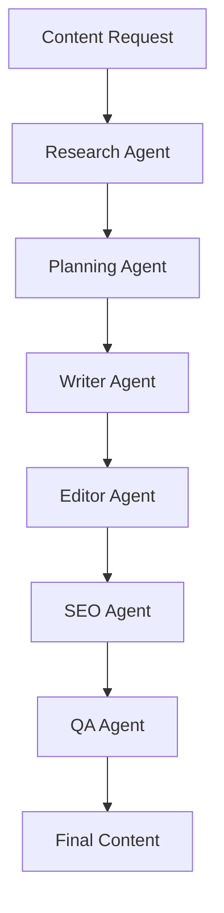

# Multi-Agent Content Creation System - Agent Documentation

## Overview

This document provides comprehensive documentation of the six specialized agents that comprise the Multi-Agent Content Creation System. Each agent has distinct roles, capabilities, and domain expertise, working collaboratively to produce high-quality, SEO-optimized content.

## Agent Architecture

The system implements a sequential workflow where agents pass state information and build upon each other's work:

## Agent Specifications

### 1. Research Agent
**Type:** Information Gathering and Data Collection Specialist

**Primary Function:** Comprehensive topic research and data collection

**Core Responsibilities:**
- Topic analysis and research query generation
- Multi-source information gathering
- Fact verification and source credibility assessment
- Data organization and synthesis
- Research quality assurance

**Domain Expertise:**
- Internet research methodologies
- Information validation techniques
- Data source evaluation
- Content research best practices
- Fact-checking and verification
- Statistical data analysis

**Specialized Tools:**
- DuckDuckGo Search Integration
- Information Extraction Algorithms
- Source Reliability Scoring
- Data Categorization Systems

**Capabilities:**
- Multi-source web research
- Information quality assessment
- Data categorization and organization
- Fact verification processes
- Research strategy formulation
- Source credibility evaluation

**Output:** Structured research data including sources, key facts, statistics, and related topics

**Workflow Position:** Foundation - First stage of content creation pipeline

---

### 2. Planning Agent
**Type:** Content Strategy and Structure Specialist

**Primary Function:** Strategic content planning and architectural design

**Core Responsibilities:**
- Content strategy formulation
- Structural planning and organization
- Keyword integration strategy
- Content flow optimization
- Target audience alignment

**Domain Expertise:**
- Content architecture design
- Editorial planning methodologies
- SEO content strategy
- Audience-focused content planning
- Content structure optimization
- Keyword integration strategies

**Specialized Tools:**
- Strategic Analysis Framework
- Content Architecture Design
- SEO Planning Integration

**Capabilities:**
- Content strategy formulation
- Structural planning and organization
- SEO strategy integration
- Audience-focused planning
- Editorial workflow design
- Content architecture optimization

**Output:** Comprehensive content plan with title, outline, key points, and target keywords

**Workflow Position:** Strategy - Second stage, transforms research into actionable plans

---

### 3. Writer Agent
**Type:** Content Creation and Composition Specialist

**Primary Function:** High-quality content creation and composition

**Core Responsibilities:**
- Content composition and creation
- Research integration and synthesis
- Tone and style consistency maintenance
- Narrative flow and structure optimization
- Audience engagement optimization

**Domain Expertise:**
- Professional writing techniques
- Content structure and flow optimization
- Audience-appropriate communication
- Research-based content development
- Multi-format content creation
- Narrative construction and storytelling

**Specialized Tools:**
- Advanced Language Generation
- Content Synthesis Engine
- Style Adaptation Framework

**Capabilities:**
- Advanced content composition
- Research integration and synthesis
- Audience-focused writing
- Multi-format content creation
- Tone and style consistency
- Narrative flow optimization

**Output:** Complete content draft with proper structure, research integration, and target word count

**Workflow Position:** Creation - Third stage, transforms plans into actual content

---

### 4. Editor Agent
**Type:** Content Refinement and Quality Enhancement Specialist

**Primary Function:** Content editing, quality improvement, and readability optimization

**Core Responsibilities:**
- Content quality assessment and improvement
- Readability analysis and optimization
- Style and tone consistency enforcement
- Grammar and language enhancement
- Content flow and structure refinement

**Domain Expertise:**
- Professional editing techniques
- Readability analysis and optimization
- Content flow and structure improvement
- Grammar and style enhancement
- Quality assurance methodologies
- Audience-focused content refinement

**Specialized Tools:**
- Content Analysis Tool (NLTK integration)
- Readability Assessment (Flesch-Kincaid metrics)
- Quality Metrics Framework

**Capabilities:**
- Advanced content editing and proofreading
- Readability analysis and optimization
- Content structure enhancement
- Style and tone consistency enforcement
- Quality metrics assessment
- Grammar and language improvement

**Output:** Refined content with improved readability, structure, and quality metrics

**Workflow Position:** Refinement - Fourth stage, improves content quality and readability

---

### 5. SEO Agent
**Type:** Search Engine Optimization Specialist

**Primary Function:** Content optimization for search engine visibility and organic discovery

**Core Responsibilities:**
- SEO analysis and assessment
- Keyword optimization and integration
- Content structure optimization for search
- Meta-information optimization
- Search visibility enhancement

**Domain Expertise:**
- Search engine optimization techniques
- Keyword research and analysis
- Content SEO best practices
- Search visibility optimization
- Technical SEO implementation
- Content structure optimization

**Specialized Tools:**
- SEO Analysis Tool
- Keyword Optimization Engine
- Search Visibility Assessment

**Capabilities:**
- Advanced SEO analysis and optimization
- Keyword research and density management
- Content structure optimization for search
- Meta-information optimization
- Search visibility enhancement
- Technical SEO implementation

**Output:** SEO-optimized content with improved search visibility and keyword integration

**Workflow Position:** Optimization - Fifth stage, enhances content for search engine visibility

---

### 6. Quality Assurance Agent
**Type:** Final Validation and Delivery Specialist

**Primary Function:** Comprehensive quality assurance and professional content delivery

**Core Responsibilities:**
- Final quality assessment and validation
- Requirements compliance verification
- Content formatting and presentation optimization
- Professional documentation and metadata generation
- Content delivery and file management

**Domain Expertise:**
- Quality assurance methodologies
- Content validation techniques
- Publication readiness assessment
- Documentation and reporting standards
- Requirements compliance verification
- Professional content formatting

**Specialized Tools:**
- Quality Assessment Framework
- Content Validation Engine
- File Management System

**Capabilities:**
- Comprehensive quality assessment
- Requirements compliance verification
- Publication readiness evaluation
- Professional content formatting
- Quality reporting and documentation
- Content delivery and file management

**Output:** Final content package with comprehensive metadata, quality reports, and professional formatting

**Workflow Position:** Finalization - Final stage, ensures quality and manages delivery

## Agent Interaction and State Management

### State Flow
Each agent receives and modifies a shared state object containing:
- Original content request
- Research data
- Content plan
- Content draft
- Analysis results
- Final content
- Feedback history
- Metadata and metrics

### Agent Communication
Agents communicate through the shared state, with each agent:
1. Receiving the current state from the previous agent
2. Performing its specialized function
3. Updating the state with its contributions
4. Passing the enhanced state to the next agent

### Quality Control
Each agent implements quality controls:
- Input validation and error handling
- Output quality scoring and metrics
- Performance monitoring and logging
- Fallback mechanisms for edge cases

## Agent Specialization Benefits

### Clear Role Separation
Each agent has a distinct, specialized role that:
- Prevents overlap and redundancy
- Ensures expert-level focus on specific tasks
- Enables parallel optimization and improvement
- Facilitates debugging and maintenance

### Scalability and Maintainability
The modular design allows for:
- Independent agent updates and improvements
- Easy addition of new agents or capabilities
- Flexible workflow modifications
- Simplified testing and validation

### Professional Standards
Each agent maintains professional standards through:
- Domain-specific expertise and best practices
- Quality metrics and performance monitoring
- Comprehensive documentation and reporting
- Validation and error handling mechanisms

## Usage and Integration

### Agent Initialization
All agents are initialized with:
- Language model instance for AI capabilities
- Specialized tools for their domain
- Configuration parameters for optimization
- Error handling and logging mechanisms

### Workflow Execution
The complete workflow:
1. Initializes with content request
2. Executes agents sequentially through LangGraph
3. Maintains state consistency throughout
4. Provides comprehensive output with full metadata

### Performance Monitoring
Each agent contributes to:
- Execution time tracking
- Quality score calculation
- Performance metrics collection
- Detailed audit trails

This multi-agent architecture ensures professional-grade content creation with clear specialization, comprehensive quality control, and scalable performance.