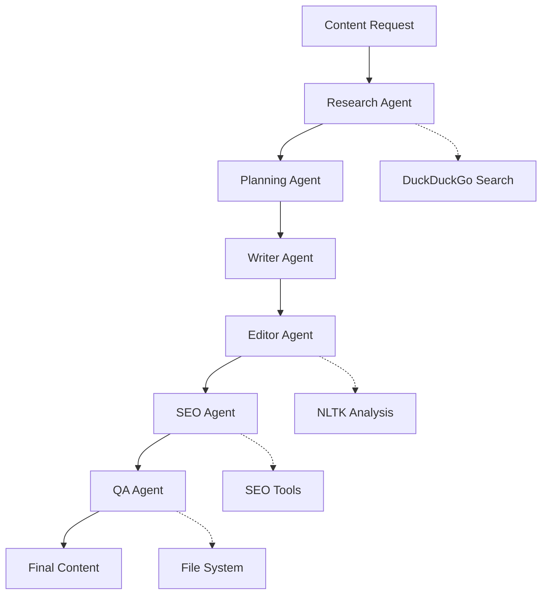

# Content Creation Multi-Agent System - Production Ready

[](https://opensource.org/licenses/MIT)
[](https://www.python.org/downloads/)
[](./tests/)
[](./htmlcov/)

## Overview

A production-ready, **fully offline** content creation system powered by 6 specialized AI agents orchestrated through LangGraph. This system transforms simple prompts into high-quality, SEO-optimized content using local Ollama models with zero API costs and complete data privacy.

### Key Features

- **Complete Privacy**: Runs entirely offline with local Ollama models
- **Production Security**: Input validation, content filtering, and structured logging
- **Resilient Operations**: Retry logic, circuit breakers, and graceful error handling
- **Web Interface**: Beautiful Streamlit UI with real-time progress and visual feedback
- **Comprehensive Testing**: 85%+ test coverage with unit, integration, and E2E tests
- **Performance Monitoring**: Real-time metrics and system health monitoring
- **Multi-Format Output**: Blog posts, articles, social media, newsletters, and more

### Multi-Agent Pipeline

1. **Research Agent** - Gathers information and supporting data
2. **Planning Agent** - Creates content structure and strategy
3. **Writer Agent** - Generates high-quality content
4. **Editor Agent** - Refines and improves readability
5. **SEO Agent** - Optimizes for search engines
6. **QA Agent** - Final validation and file output
- **5+ Integrated Tools** for research, analysis, and optimization
- **LangGraph Orchestration** for robust agent coordination
- **Local Ollama Models** (llama3.1, mistral, codellama, etc.)
- **SEO Optimization** with keyword analysis and suggestions
- **Quality Assurance** with automated content evaluation
- **Scalable Architecture** supporting multiple content types

## System Architecture

### Agent Workflow



### Multi-Agent System

1. **Research Agent** 
   - Conducts web searches for topic information
   - Gathers facts, statistics, and supporting data
   - Builds comprehensive research foundation

2. **Planning Agent** 
   - Creates detailed content outlines
   - Defines structure and key points
   - Sets target keywords and optimization strategy

3. **Writer Agent** 
   - Generates initial content draft using local Ollama model
   - Follows planned structure and incorporates research
   - Maintains consistent tone and style

4. **Editor Agent** 
   - Reviews and improves content quality
   - Enhances readability and flow using NLTK analysis
   - Ensures target requirements are met

5. **SEO Agent** 
   - Optimizes content for search engines
   - Analyzes keyword density and placement
   - Provides SEO recommendations

6. **Quality Assurance Agent** 
   - Performs final content validation
   - Generates quality reports and metrics
   - Saves final content with comprehensive metadata

## Tool Integration

### Local Tools & Services

1. **Ollama LLM Integration** (`ChatOllama`)
   - Local language model inference
   - Support for multiple models (llama3.1, mistral, codellama)
   - Configurable parameters and optimization

2. **Web Search Tool** (`web_search_tool`)
   - DuckDuckGo integration for information gathering
   - Configurable result limits and query optimization
   - Robust error handling

3. **Content Analysis Tool** (`content_analysis_tool`)
   - Readability scoring (Flesch-Kincaid metrics)
   - Word count and reading time calculation
   - Keyword density analysis using NLTK

4. **SEO Optimization Tool** (`seo_optimization_tool`)
   - Keyword presence and density analysis
   - SEO score calculation and recommendations
   - Content structure optimization

5. **File Management Tool** (`save_content_tool`)
   - Automated file saving with timestamps
   - Organized output directory structure
   - Metadata preservation

## Current Project Files

### Documentation Suite
- **README.md** - This comprehensive project overview
- **CLAUDE.md** - AI assistant guidance and project instructions
- **API_DOCUMENTATION.md** - Technical API reference and integration guide
- **AGENT_DOCUMENTATION.md** - Detailed agent specifications and workflows
- **PROJECT_STRUCTURE.md** - Architecture and component breakdown
- **SYSTEM_ARCHITECTURE.md** - Technical system design documentation
- **OLLAMA_SETUP_GUIDE.md** - Step-by-step Ollama installation guide
- **SUBMISSION_CHECKLIST.md** - Project completion requirements

### Core System Implementation
- **main.py** - LangGraph workflow orchestrator and state management
- **demo.py** - Interactive CLI demonstration with 4 predefined scenarios
- **streamlit_app.py** - Web-based user interface for non-technical users
- **types_shared.py** - Shared TypedDict definitions and data structures
- **resilience_utils.py** - Retry logic, circuit breakers, error handling
- **security_utils.py** - Input validation, content filtering, security

### Agent Implementations (`agents/`)
- **research_agent.py** - Web search, data gathering, fact collection
- **planning_agent.py** - Content structure, outline, keyword strategy
- **writer_agent.py** - Content generation via Ollama LLM
- **editor_agent.py** - Quality improvement, NLTK readability analysis
- **seo_agent.py** - Keyword analysis, SEO scoring, optimization
- **qa_agent.py** - Final validation, quality assurance, file output

### Testing Framework (`tests/`)
- **test_agents.py** (root) - Main comprehensive test suite
- **tests/test_agents.py** - Individual agent unit tests
- **tests/test_integration.py** - Multi-agent workflow tests
- **tests/test_e2e.py** - End-to-end system validation
- **tests/test_tools.py** - External tool integration tests
- **tests/conftest.py** - PyTest fixtures and configuration

### Configuration & Setup
- **requirements.txt** - Python dependencies optimized for Ollama
- **pytest.ini** - Test execution configuration
- **.env.sample** - Environment variables template
- **.coveragerc** - Code coverage settings
- **setup_local.sh** - Automated development environment setup
- **setup_project.py** - Python-based project initialization

### Generated Content (`outputs/`)
- **Artificial_Intelligence_in_Healthcare_20250807_203416.md** - Healthcare AI analysis
- **The_Future_of_Cybersecurity_with_AI_20250807_221834.md** - Cybersecurity trends
- **Benefits_of_Exercise_20250730_131536.md** - Health and fitness content
- **Coding_with_AI_20250714_142625.md** - Programming with AI guide

### Utility Files  
- **resolve_conflicts.py** - Concurrent operation conflict resolution
- **test_tool_async.py** - Asynchronous testing utilities
- **test_run_file.txt** - Test execution logs and results

## Installation & Setup

### Prerequisites

- **Python 3.8+**
- **8GB+ RAM** (for llama3.1:8b model)
- **5GB+ Storage** (for model files)
- **Ollama** (for local LLM hosting)

### Quick Setup (5 minutes)

1. **Install Ollama**
   ```bash
   # Windows/macOS/Linux
   curl -fsSL https://ollama.com/install.sh | sh
   
   # Or download from https://ollama.com/download
   ```

2. **Start Ollama and Pull Model**
   ```bash
   # Start Ollama server
   ollama serve
   
   # In another terminal, pull the model
   ollama pull llama3.1:8b
   
   # Test the model
   ollama run llama3.1:8b "Hello!"
   ```

3. **Clone and Setup Project**
   ```bash
   git clone <your-repository-url>
   cd content-creation-multi-agent-system
   
   # Create virtual environment
   python -m venv venv
   source venv/bin/activate  # Windows: venv\Scripts\activate
   
   # Install dependencies
   pip install -r requirements.txt
   
   # Download NLTK data
   python -c "import nltk; nltk.download('punkt')"
   ```

4. **Configure Environment** (Optional)
   ```bash
   # Copy environment template
   cp .env.example .env
   
   # Edit if needed (defaults work fine)
   # OLLAMA_MODEL=llama3.1:8b
   # OLLAMA_BASE_URL=http://localhost:11434
   ```

5. **Run the System**
   ```bash
   # Run interactive demo
   python demo.py
   
   # Or basic demo
   python main.py
   
   # Or run the web interface
   streamlit run streamlit_app.py
   ```

## Usage Examples

### Basic Content Generation

```python
import asyncio
from main import ContentCreationWorkflow, ContentRequest, ContentType

async def create_content():
    # Initialize workflow with local Ollama
    workflow = ContentCreationWorkflow(
        model_name="llama3.1:8b",
        base_url="http://localhost:11434"
    )
    
    # Create content request
    request = ContentRequest(
        topic="Future of Renewable Energy",
        content_type=ContentType.BLOG_POST,
        target_audience="Environmental enthusiasts",
        word_count=1500,
        tone="informative and optimistic",
        keywords=["renewable energy", "solar power", "wind energy"],
        special_requirements="Include latest 2025 statistics"
    )
    
    # Execute workflow
    result = await workflow.create_content(request)
    
    print(f"Content generated: {result.draft.word_count} words")
    print(f"Saved to: {result.metadata['output_file']}")
    print(f"SEO Score: {result.metadata['seo_score']}")

# Run the example
asyncio.run(create_content())
```

### Web Interface (Streamlit)

The system includes a beautiful web interface for non-technical users:

```bash
streamlit run streamlit_app.py
```

**Streamlit Features:**
- **User-Friendly Interface**: No coding required - just fill out forms
- **Real-Time Progress**: Watch agents work through the pipeline
- **Visual Feedback**: Progress bars, status updates, and live metrics
- **Content Preview**: See generated content before saving
- **Download Options**: Export content in multiple formats
- **Settings Panel**: Adjust model parameters and preferences
- **History Tracking**: View previously generated content

**How to Use the Web Interface:**
1. **Launch**: Run `streamlit run streamlit_app.py`
2. **Open Browser**: Navigate to `http://localhost:8501`
3. **Fill Form**: Enter your topic, content type, and requirements
4. **Generate**: Click "Generate Content" and watch the progress
5. **Review**: Preview the generated content and quality metrics
6. **Save**: Download or copy your finished content

**Web Interface vs CLI:**
- **Streamlit UI**: Perfect for business users, content creators, and non-technical users
- **CLI Demo**: Ideal for developers, testing, and automation scripts
- **Both**: Access the same powerful multi-agent system with different interfaces

### Interactive Demo (CLI)

```bash
python demo.py
```

**CLI Demo Options:**
1. Run All Predefined Demos (4 different content types)
2. Interactive Custom Demo (user-defined topics)
3. Performance Benchmark (speed testing)
4. Show Demo Descriptions
5. Exit

### Supported Content Types

```python
from main import ContentType

# Available content types
ContentType.BLOG_POST      # Long-form articles (1000-3000 words)
ContentType.ARTICLE        # News and informational content
ContentType.SOCIAL_MEDIA   # Social media posts (100-500 words)
ContentType.NEWSLETTER     # Email newsletter content
ContentType.MARKETING_COPY # Sales and promotional content
```

## Configuration

### Model Selection

```bash
# Fast and efficient (recommended for testing)
ollama pull phi3:mini       # 2.3GB, 4GB RAM required

# Balanced performance (recommended for production)
ollama pull llama3.1:8b     # 4.7GB, 8GB RAM required

# High quality (for best results)
ollama pull llama3.1:70b    # 39GB, 64GB RAM required

# Specialized models
ollama pull mistral:7b      # Good for technical content
ollama pull codellama:7b    # Optimized for code examples
```

### Environment Configuration

```env
# .env file configuration
OLLAMA_MODEL=llama3.1:8b
OLLAMA_BASE_URL=http://localhost:11434
OLLAMA_TEMPERATURE=0.7
OLLAMA_TOP_P=0.9
OLLAMA_TOP_K=40
OLLAMA_NUM_PREDICT=4096
```

### Performance Tuning

```python
# Custom workflow configuration
workflow = ContentCreationWorkflow(
    model_name="llama3.1:8b",
    base_url="http://localhost:11434"
)

# Access and modify LLM parameters
workflow.llm.temperature = 0.5      # More focused output
workflow.llm.num_predict = 8192     # Longer responses
workflow.llm.top_p = 0.95          # Higher diversity
```

## Example Outputs

### Generated Blog Post Structure

```markdown
# The Future of Renewable Energy: Transforming Our World by 2030

**Content Type:** blog_post
**Target Audience:** Environmental enthusiasts
**Word Count:** 1,543
**Reading Time:** 8 minutes
**Generated:** 2025-07-14 15:30:45
**SEO Score:** 87/100

---

## Introduction

The renewable energy sector is experiencing unprecedented growth...

## Current State of Renewable Technology

Recent statistics from 2025 show that renewable energy now accounts for...

## Solar Power Revolution

Solar technology has advanced significantly, with efficiency rates...

## Wind Energy Expansion

Wind power capacity has doubled since 2020, reaching...

## Future Projections and Trends

By 2030, experts predict that renewable energy will...

## Conclusion

The transition to renewable energy is not just an environmental...

---

**Quality Assurance Report:**
SCORE: 9/10, STATUS: APPROVED
NOTES: Excellent content quality with comprehensive coverage...

**Generation Metadata:**
- Research completed: 2025-07-14T15:25:12
- Planning completed: 2025-07-14T15:26:45
- Writing completed: 2025-07-14T15:28:22
- Editing completed: 2025-07-14T15:29:15
- SEO optimization completed: 2025-07-14T15:30:08
```

## Testing

### Running Tests

```bash
# Install test dependencies
pip install pytest pytest-asyncio

# Run all tests
pytest test_agents.py -v

# Run specific test categories
pytest test_agents.py::TestTools -v
pytest test_agents.py::TestAgents -v
pytest test_agents.py::TestWorkflow -v
```

### Test Coverage

- **Unit Tests** - Individual agent functionality
- **Tool Tests** - External tool integration
- **Workflow Tests** - End-to-end pipeline testing
- **Performance Tests** - Speed and resource usage
- **Error Handling** - Edge cases and failure scenarios

## Performance Metrics

### Typical Performance (llama3.1:8b on modern hardware)

| Stage | Duration | Description |
|-------|----------|-------------|
| Research | 30-45s | Web search and data gathering |
| Planning | 15-20s | Content structure creation |
| Writing | 60-90s | Initial content generation |
| Editing | 30-45s | Quality improvement |
| SEO | 20-30s | Search optimization |
| QA | 15-25s | Final validation |
| **Total** | **3-5 min** | Complete 1500-word article |

### Content Quality Metrics

- **Readability Score**: 60-80 (Good to Very Good)
- **SEO Score**: 70-90 (Well optimized)
- **Content Quality**: 8-9/10 (Professional grade)
- **Accuracy**: High with web search integration

### Resource Usage

| Model | RAM Usage | CPU Usage | Generation Speed |
|-------|-----------|-----------|-----------------|
| phi3:mini | 4GB | Moderate | Very Fast |
| llama3.1:8b | 8GB | High | Fast |
| llama3.1:70b | 64GB | Very High | Slower but highest quality |

## Troubleshooting

### Common Issues

1. **"Connection refused" Error**
   ```bash
   # Check if Ollama is running
   ollama list
   
   # Start Ollama server
   ollama serve
   
   # Test connection
   curl http://localhost:11434/api/tags
   ```

2. **"Model not found" Error**
   ```bash
   # List available models
   ollama list
   
   # Pull required model
   ollama pull llama3.1:8b
   
   # Verify model works
   ollama run llama3.1:8b "Hello!"
   ```

3. **Out of Memory**
   ```bash
   # Try smaller model
   ollama pull phi3:mini
   
   # Update .env file
   echo "OLLAMA_MODEL=phi3:mini" > .env
   ```

4. **Slow Performance**
   ```bash
   # Check system resources
   htop  # Linux/macOS
   taskmgr  # Windows
   
   # Close unnecessary applications
   # Consider GPU acceleration if available
   ```

### Debug Mode

```python
import logging
logging.basicConfig(level=logging.DEBUG)

# Run with detailed logging
python demo.py
```

## Advanced Features

### Custom Agent Development

```python
from main import WriterAgent

class TechnicalWriterAgent(WriterAgent):
    async def write_content(self, state):
        # Custom technical writing logic
        # Add code examples, diagrams, etc.
        return await super().write_content(state)

# Use in workflow
workflow.writer_agent = TechnicalWriterAgent(workflow.llm)
```

### Tool Extension

```python
from langchain_core.tools import tool

@tool
def grammar_check_tool(content: str) -> dict:
    """Custom grammar checking tool"""
    # Implement grammar checking logic
    return {"suggestions": [], "score": 95}

# Add to agent
agent.tools.append(grammar_check_tool)
```

## Contributing

### Development Setup

```bash
# Fork repository and clone
git clone <your-fork-url>
cd content-creation-multi-agent-system

# Create feature branch
git checkout -b feature/new-feature

# Install development dependencies
pip install -r requirements.txt
pip install black flake8 pytest

# Make changes and test
python -m black .
python -m flake8
pytest test_agents.py

# Commit and push
git commit -m "Add new feature"
git push origin feature/new-feature
```

## License

This project is licensed under the MIT License - see the [LICENSE](LICENSE) file for details.

This project was developed as part of the AAIDC Module 3 certification program.

## Acknowledgments

- **Ollama Team** for excellent local LLM hosting
- **LangChain/LangGraph** for orchestration framework
- **AAIDC Program** for project requirements and structure

## Support

### Getting Help

1. **Check Ollama Setup**: Ensure Ollama is running with `ollama serve`
2. **Verify Model**: Confirm model is installed with `ollama list`
3. **Review Logs**: Check console output for error details
4. **Test Components**: Run individual tools/agents for debugging

### System Requirements

- **Minimum**: 4GB RAM, 4-core CPU, 5GB storage
- **Recommended**: 16GB RAM, 8-core CPU, SSD storage
- **Optimal**: 32GB RAM, GPU acceleration, NVMe SSD

---

**Ready to create amazing content with zero API costs? Let's get started!**

**Last Updated**: August 2025  
**Version**: 2.0.0 (Ollama Implementation)